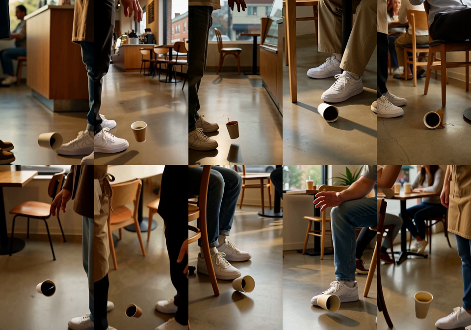

# ai-film-crew 🎬

**A film crew for your AI video prompts.** A director, production designer, DP, gaffer,
editor, sound designer and script supervisor turn a one-line idea into a shot list and
one model-ready prompt per shot. Runs as an agent skill in Claude Code, Codex, Cursor and anything else that reads `SKILL.md`.

Works with Wan, LTX-Video, HunyuanVideo, Kling, Veo, Seedance, Hailuo/MiniMax, Runway,
Luma, or whatever you run.

<p align="center">
  
  <br><sub>Ten rerolls of one prompt. The coffee was supposed to spill. The prompt was the problem, not the dice.</sub>
</p>

## Why

AI video rarely lands on the first try. Most failed clips fail for boring, fixable reasons:

- two actions crammed into one clip
- no camera instruction, so the camera wanders
- a character described differently in every shot, so they turn into a different person
- physics the model can't do in 5 seconds, framed too wide
- a prompt that describes a *feeling* instead of a *frame*

A real crew catches these before anyone rolls camera. This skill does the same before you
spend a generation, and tells you **which one thing to change** after a bad one.

## Install

```bash
npx skills add HEOJUNFO/ai-film-crew
```

Or manually:

```bash
git clone https://github.com/HEOJUNFO/ai-film-crew
cp -r ai-film-crew/skills/film-crew ~/.claude/skills/
```

## Use

Just ask for a video. The skill picks the mode.

```
> 15s vertical ad for a handmade ceramic mug, for Kling
> plan a 30s music video intro: neon rain, lone skater, Wan 2.x
> this prompt keeps failing: "a chef flips a pancake in slow motion, cinematic, 8k"
> I rerolled this 6 times and her face keeps changing, what do I fix?
```

| Mode | You give it | You get |
|---|---|---|
| **Plan** | an idea, script, or product | `SHOT_LIST.md`: crew notes, shot table, one prompt per shot, reroll plan |
| **Fix** | a prompt that isn't working | what's wrong (ranked) + the rewrite, before → after |
| **Review** | a bad clip (frames or a description) | failure class + the *one* change to make before rerolling |

## The crew

| Role | Owns | Catches |
|---|---|---|
| [Director](skills/film-crew/roles/director.md) | logline, beats, the 1.5 s hook | mood-only "beats", slow openings |
| [Production designer](skills/film-crew/roles/production-designer.md) | the continuity bible | characters drifting between shots |
| [DP](skills/film-crew/roles/dp.md) | shot size, lens, one camera move | combined moves that warp geometry |
| [Gaffer](skills/film-crew/roles/gaffer.md) | motivated light, color temperature | flat, evenly lit "AI look" |
| [Editor](skills/film-crew/roles/editor.md) | durations, handles, cuts, loop | shots longer than the model can make |
| [Sound](skills/film-crew/roles/sound.md) | dialogue/SFX for audio models | sound cues on silent models |
| [Script supervisor](skills/film-crew/roles/script-supervisor.md) | continuity + feasibility + unslop | has veto power over every shot |

Plus references for [per-model prompting](skills/film-crew/references/model-prompting.md),
[unslop](skills/film-crew/references/unslop.md) (why AI video looks like AI video) and
[reroll review](skills/film-crew/references/reroll-review.md).

## Example

[`examples/coffee-spill-15s/SHOT_LIST.md`](examples/coffee-spill-15s/SHOT_LIST.md): the
prompt from the image above, replanned by the crew into 5 shots. The script supervisor's
catch: the bump and the spill were fighting in one clip, and the spill was the last
clause, so the model kept skipping it.

[`examples/ceramic-mug-ad-kling/SHOT_LIST.md`](examples/ceramic-mug-ad-kling/SHOT_LIST.md):
*"15s vertical ad for a handmade ceramic mug, for Kling. just go."*, the skill's full
output, untouched: 5 shots cut to a 96 BPM track, looping back to the first frame, with
image-to-video variants for shooting your real product.

## What it doesn't do

It doesn't generate video. It plans and writes prompts. Bring your own model: ComfyUI
locally, fal, Replicate, or any hosted app.

## Where the demo clips came from

The ten rerolls above were generated with [Ludyte](https://share.ludyte.com/junfoi), a
hosted AI video app with the same crew-plans-first idea built in, flat monthly price and
no per-generation credits. **Disclosure: I work on Ludyte.** The skill is MIT and
model-agnostic; nothing in it depends on Ludyte.

## Contributing

Video models change every few months. If an adapter in
`references/model-prompting.md` is out of date, or you have a before/after that proves a
rule wrong, open a PR. Examples with real before/after rerolls are the most valuable
contribution.

## License

MIT
